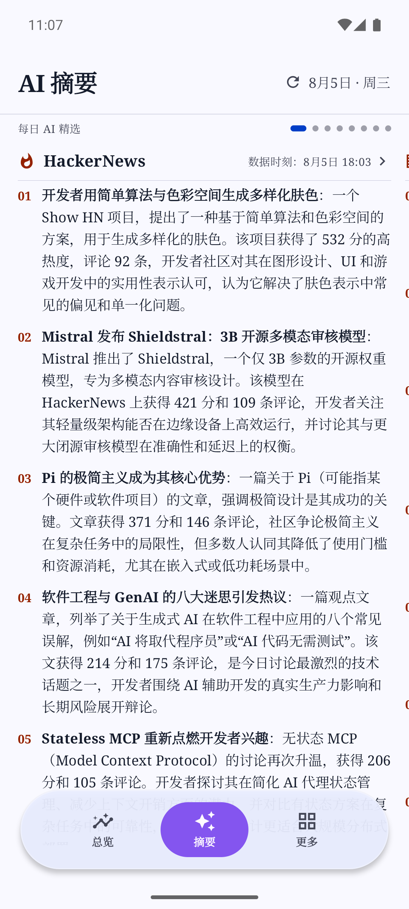
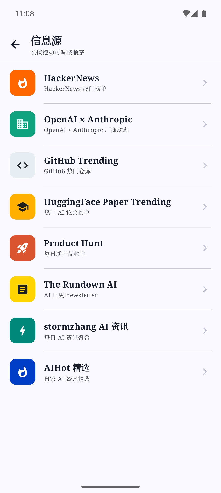
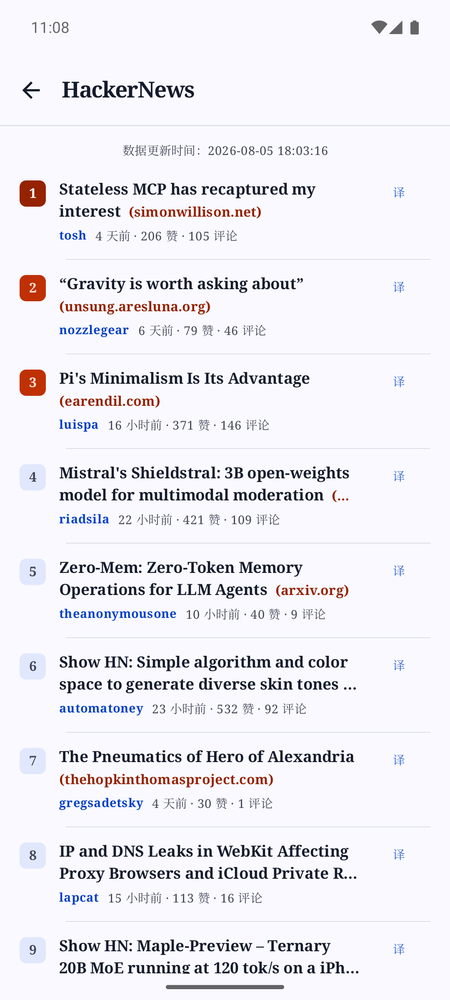
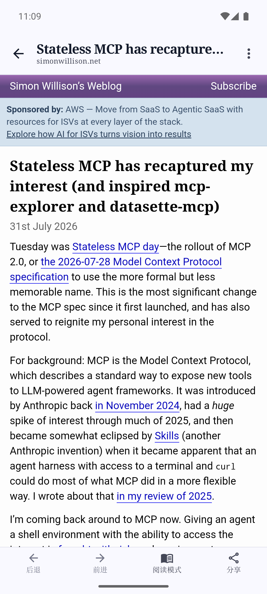
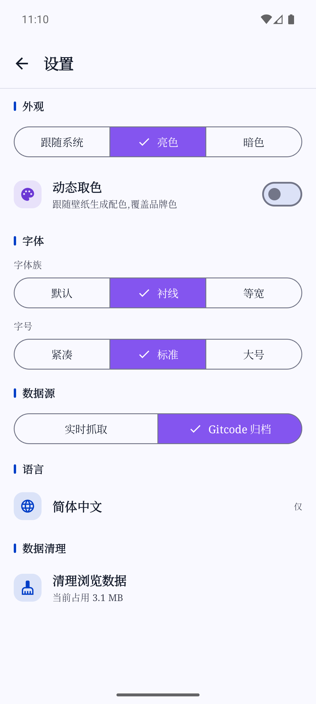
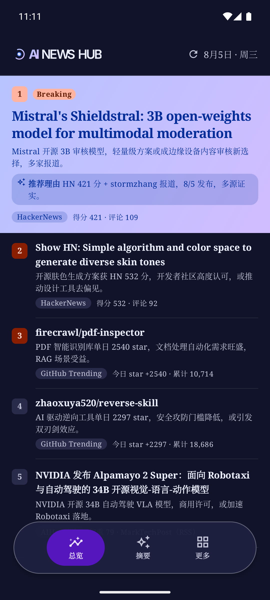

# AI News Hub

> **English** | [简体中文](README.zh-CN.md)

> An Android app that answers "what happened in AI today" in a single feed.

[](https://github.com/burgessjp/AI-News-Hub/actions/workflows/build.yml)
[](https://github.com/burgessjp/AI-News-Hub/releases)
[](LICENSE)
[](https://kotlinlang.org)
[-green.svg)](https://developer.android.com/about/versions/nougat)
[](https://www.android.com)

## Download

[](https://github.com/burgessjp/AI-News-Hub/releases/latest)
[](https://github.com/burgessjp/AI-News-Hub/releases/latest)

Download the latest APK from the [Releases](https://github.com/burgessjp/AI-News-Hub/releases/latest) page, or grab the most recent debug build from [Actions](https://github.com/burgessjp/AI-News-Hub/actions/workflows/build.yml).

## Why use it

- **Read the whole AI world in one screen** — Aggregates 8 high-quality sources (HackerNews, GitHub Trending, HuggingFace Papers, Product Hunt, and more) so you can catch up on the day in one app.
- **AI does the heavy lifting** — A companion pipeline pre-generates Chinese bullet points for every source and a cross-source "Today's Top 10" every day. Open and read instantly, zero waiting. Breaking items are flagged.
- **You control the sources** — 5 stable sources support a "live / archived snapshot" toggle; long-press and drag the source tiles to customize the order.
- **Your AI key stays yours** — Runtime AI features like full-page translation ship with no built-in key. You bring your own provider (DeepSeek / Zhipu GLM / any OpenAI-compatible service), stored only in app-private storage.
- **Read everything in-app** — Every link in the app opens in the built-in WebView with Reader Mode and full-page translation. No jumping out to an external browser.
- **Home screen widget** — A "Today's Hot" widget that auto-refreshes every 30 minutes; jump straight to the highlights from your home screen.

---

## 📖 Overview

**AI News Hub** aggregates multiple high-quality AI sources — HackerNews, GitHub Trending, HuggingFace Papers, Product Hunt, stormzhang AI, The Rundown AI, OpenAI × Anthropic updates, plus the "AIHot Picks" and AI Daily from `aihot.virxact.com` — and layers on top of them "Today's Top 10", "Chinese summaries", and "full-page translation" so you can finish the day's AI news in a single app.

- Tech stack: Kotlin + Jetpack Compose + Material 3
- Single-module project, package name `com.peng.ainewshub`
- Targets Android 7.0 (API 24) and above

## Screenshots

| Overview | Summary | Sources | HackerNews |
|:---:|:---:|:---:|:---:|
|  |  |  |  |

| WebView Reader | Settings | Overview (Dark) |
|:---:|:---:|:---:|
|  |  |  |

---

## ✨ Core features

### Three root tabs

| Tab | What it does |
|-----|--------|
| **Overview** | Cross-source "Today's Top 10" — a comprehensive analysis pre-generated by the pipeline. Items the AI flags as "breaking" get a Breaking badge and a distinct style, pinned to the top. Open and read, zero waiting. |
| **Summary** | The day's AI bullet points (in Chinese, pre-generated by the pipeline) for 8 archived sources. Instant, no waiting. |
| **More** | Settings, AI service config, source hub, archive history, AI Daily archive, About, etc. |

### Browse area (More → Sources)

8 source tiles, each with its own detail page:

- **HackerNews** — Firebase API live leaderboard + expandable comment trees
- **GitHub Trending** — filter by repo language / time window
- **OpenAI × Anthropic** — aggregated official updates from two leading AI labs
- **HuggingFace Papers** — trending papers leaderboard
- **Product Hunt** — daily product leaderboard (archive mode only)
- **The Rundown AI**, **stormzhang AI** — English / Chinese AI newsletters
- **AIHot Picks** — "Today's Hot + Picks TOP20" from the third-party service aihot.virxact.com

5 of the stable sources (HackerNews / GitHub Trending / HuggingFace Papers / The Rundown AI / stormzhang AI) support a "live / archived snapshot" toggle (Settings → Source mode); the archive is produced by the companion data pipeline.

### AI capabilities

- **AI Chinese summaries** (pipeline pre-generated): the day's bullet points for every archived source, instant on open
- **Today's Top 10** (pipeline pre-generated): cross-source comprehensive analysis; breaking items get a Breaking badge
- **Full-page translation** (runtime, user-supplied key): "Translate this page" in the built-in WebView and the "译" entry in the system text-selection menu
- **Usage tracking**: tokens aggregated by "model × month", with cost estimates from list prices

### Built-in WebView

Every link in the app opens in-app, never in an external browser:

- Reader Mode (injects Mozilla Readability to extract the article body)
- Full-page translation (side-by-side with the original, draggable half/full-screen panel)
- Web downloads, HTML5 video fullscreen, long-press image/link actions
- Font size follows the system setting

### More

- **AI Daily** and **historical archive** (browse back by date)
- **Search**: local search history + trending-word hints from Today's Hot
- **Browsing history** (stored locally in Room)
- **Theme**: Material You dynamic color (Android 12+), font family toggle (default / serif / monospace), size presets, dark mode
- **Languages**: switch between Simplified Chinese and English

---

## 🛠 Build from source

### Requirements

- JDK 17
- Android Studio (any recent version supporting AGP 8.7.3) or command-line Gradle only
- Android SDK Platform 35, Build-Tools 35.x

### Debug build

```bash
git clone <this-repo-url>
cd AI-News-Hub
cp local.properties.example local.properties   # edit the SDK path if needed (if no sample exists, set sdk.dir manually)
./gradlew assembleDebug                        # output: app/build/outputs/apk/debug/app-debug.apk
./gradlew installDebug                         # install directly onto a connected device/emulator
```

### Release build

Release builds require local signing material (**never committed to the repo**):

1. Place a `keystore.properties` at the project root:

   ```properties
   storeFile=app/release.jks
   storePassword=***
   keyAlias=***
   keyPassword=***
   ```

2. Place the matching `release.jks` under `app/`.

3. Run:

   ```bash
   ./gradlew assembleRelease
   # output: app/build/outputs/apk/release/app-release.apk
   ```

CI (GitHub Actions) restores the keystore from repository secrets; tagging `v*` produces a Release automatically.

---

## 🔑 Configure the AI service

AI News Hub's runtime AI features such as full-page translation **ship with no built-in key** — you provide one in-app (pre-generated content like summaries and Today's Hot needs no key and is instant):

Open the app → **More → AI Service**, pick a provider preset (DeepSeek / Zhipu GLM / custom OpenAI-compatible service) → fill in the API key and model name → save.

- The key lives only in app-private storage (DataStore) — never uploaded, never logged.
- The "Custom" option works with any service that speaks the OpenAI API protocol; just fill in `baseUrl` (including the `/v1` segment).
- Usage and cost estimates are visible on the AI Service page.

---

## 📰 Data sources

| Category | Source | Notes |
|------|------|------|
| Third-party API | `aihot.virxact.com` public API | AIHot Picks (Today's Hot + TOP20), AI Daily and archive |
| Third-party · live | HackerNews, GitHub Trending, HuggingFace Papers, etc. | Fetched directly inside the app |
| Third-party · archive | Companion data pipeline | Fetched daily at 15:30 (Beijing time) + AI-summarized + pushed to the [gitcode data repo](https://gitcode.com/peng1818/AI-News-Hub-Data) |
| Runtime AI (user-supplied key) | User-provided | Web full-page translation, system text-selection translation |

The data-repo format is documented in [`docs/news-hub-data-usage.md`](docs/news-hub-data-usage.md).

---

## 🗂 Project layout

```
app/                       the single Android module
  src/main/java/com/peng/ainewshub/
    MainActivity.kt        custom multi-stack navigation + page routing (no Navigation Compose)
    data/                  Repository, data models, Room, DataStore, source dual-mode
    ui/                    ViewModel + Compose Screen, split by feature
      tabs/                the 3 root-tab scaffolds
      overview/            today's overview (reads pipeline-pre-generated cross-source analysis)
      summary/             Summary tab + archive history
      items/               AIHot Picks list / all activity
      daily/               AI Daily and archive
      more/                More page / Sources / About
      webview/             built-in WebView + Reader Mode + full-page translation
      translate/           translation repo + system text-selection entry
      widget/              Glance home-screen widget ("Today's Hot")
      components/          reusable components (cards, badges, skeletons, SectionHeader)
      theme/               Material 3 two-tier theme (spec + semantic)
      anim/                transition-animation specs
  src/main/assets/readability.js   WebView Reader Mode body extraction
scripts/                   Python data pipeline + icon generation
docs/news-hub-data-usage.md   data-repo format and consumption
.github/workflows/         CI (build) / release / data pipeline
gradle/libs.versions.toml  all dependency versions centralized
```

> Want a deeper look at the architecture, conventions, and every pipeline script? Read [`AGENTS.md`](AGENTS.md).

---

## 🤖 Data pipeline (optional)

If you need to run the data pipeline yourself (e.g. to deploy a private data source):

```bash
pip install -r scripts/requirements.txt
python -m playwright install --with-deps chromium   # only needed for the LinuxDo source to pass Cloudflare

export AI_NEWS_HUB_AI_BASE_URL=...
export AI_NEWS_HUB_AI_MODEL=...
export AI_NEWS_HUB_AI_API_KEY=...
export GITCODE_TOKEN=...
export PRODUCT_HUNT_KEY=...                          # optional; if absent, that source is skipped

bash scripts/pipeline.sh
```

The pipeline is orchestrated by `scripts/pipeline.sh`; missing any hard-required env var exits immediately. A single-source failure doesn't affect the others — the `index.json` latest pointer is inherited from the last successful snapshot, so the client always gets valid data.

---

## 🧰 Tech stack

| Component | Version |
|------|------|
| Kotlin | 2.0.21 |
| Jetpack Compose | BOM 2024.12.01 |
| Material 3 | — |
| AGP | 8.7.3 |
| OkHttp | 4.12.0 |
| jsoup | 1.18.3 |
| Coil | 2.7.0 |
| Room | 2.6.1 |
| DataStore | 1.1.1 |
| Glance (home widget) | 1.1.1 |
| KSP | 2.0.21-1.0.28 |
| minSdk | 24 (Android 7.0) |
| targetSdk / compileSdk | 35 |

No Retrofit / Gson / Moshi — networking goes through `OkHttp` uniformly, JSON uses the built-in `org.json`, and HTML parsing uses jsoup.

---

## ⚠️ Known limitations

- **LinuxDo source is failure-prone** — it sits behind a strict Cloudflare challenge, and CI runner data-center IPs may be additionally throttled. A single-source failure is a known risk: it gets skipped and does not affect the others.
- **Product Hunt is archive-only** — its Developer Token is a server-side secret that never enters the APK, so both modes use the archive.
- **Translation needs a user-supplied key** — without an AI service configured, full-page and text-selection translation are unavailable (pre-generated content like summaries and Today's Hot is unaffected).
- **Archive failure does not fall back to live** — in archive mode a fetch failure shows an Error state directly; by design it does not auto-degrade.
- **The home widget has no error interaction** — on fetch failure it keeps the old data without clearing (the widget can't show an error state).

---

## 📜 Open-source acknowledgements

This project is built on these excellent open-source components:

### Core assets

| Library / asset | Use | License |
|---|---|---|
| [Mozilla Readability](https://github.com/mozilla/readability) | WebView Reader Mode body extraction | Apache-2.0 |
| [Inter Font](https://github.com/rsms/inter) | Embedded font | SIL OFL 1.1 |

### AndroidX / Jetpack

| Library | Use | License |
|---|---|---|
| [Jetpack Compose](https://developer.android.com/jetpack/compose) + [Material 3](https://m3.material.io/) | Declarative UI framework and design system | Apache-2.0 |
| [Activity-Compose](https://developer.android.com/jetpack/androidx/releases/activity) | Compose integration (incl. predictive back gesture) | Apache-2.0 |
| [Lifecycle](https://developer.android.com/jetpack/androidx/releases/lifecycle) + [ViewModel](https://developer.android.com/topic/libraries/architecture/viewmodel) | Lifecycle and state management | Apache-2.0 |
| [DataStore](https://developer.android.com/topic/libraries/architecture/datastore) | Preference persistence | Apache-2.0 |
| [Room](https://developer.android.com/jetpack/androidx/releases/room) | SQLite abstraction (browsing history) | Apache-2.0 |
| [Glance](https://developer.android.com/jetpack/androidx/releases/glance) | Home-screen widget | Apache-2.0 |
| [WebKit](https://developer.android.com/jetpack/androidx/releases/webkit) | Built-in WebView enhancements | Apache-2.0 |
| [Core KTX](https://developer.android.com/kotlin/ktx/extensions) | Kotlin extensions | Apache-2.0 |

### Networking & media

| Library | Use | License |
|---|---|---|
| [OkHttp](https://square.github.io/okhttp/) | HTTP client | Apache-2.0 |
| [jsoup](https://jsoup.org/) | HTML scraping and parsing | MIT |
| [Coil](https://coil-kt.github.io/coil/) | Image loading | Apache-2.0 |

### Interaction

| Library | Use | License |
|---|---|---|
| [reorderable](https://github.com/aclassen/ComposeReorderable) | Long-press drag-to-reorder for source tiles | Apache-2.0 |

### Build toolchain

| Library | Use | License |
|---|---|---|
| [Android Gradle Plugin](https://developer.android.com/build) (AGP) | Android build | Apache-2.0 |
| [Kotlin](https://kotlinlang.org) + [Compose Compiler Plugin](https://android.googlesource.com/platform/external/kotlin-native/) | Language and Compose compilation | Apache-2.0 |
| [KSP](https://github.com/google/ksp) | Kotlin Symbol Processing (Room annotation processing) | Apache-2.0 |

> The license info above is based on each project's official statement. This project itself is released under the [MIT License](LICENSE).

---

## 🤝 Contributing

Issues and Pull Requests are welcome. Please read the [contributing guide](CONTRIBUTING.md) and the [code of conduct](CODE_OF_CONDUCT.md) first.

See [CHANGELOG.md](CHANGELOG.md) for version history.

---

## 📄 License

This project is open-sourced under the [MIT License](LICENSE). You're free to use, modify, and distribute it (including commercially) as long as you retain the copyright and license notice.

> The content of the data sources (HackerNews / GitHub / Product Hunt / LinuxDo, etc.) is copyrighted by each source. This project only aggregates and displays it as a client and does not store or redistribute the original content. When extending the project or deploying a private data pipeline, please respect each source's rate limits and terms of service.
