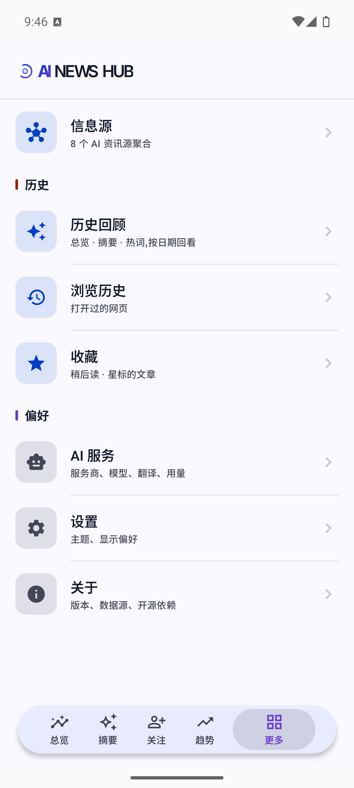
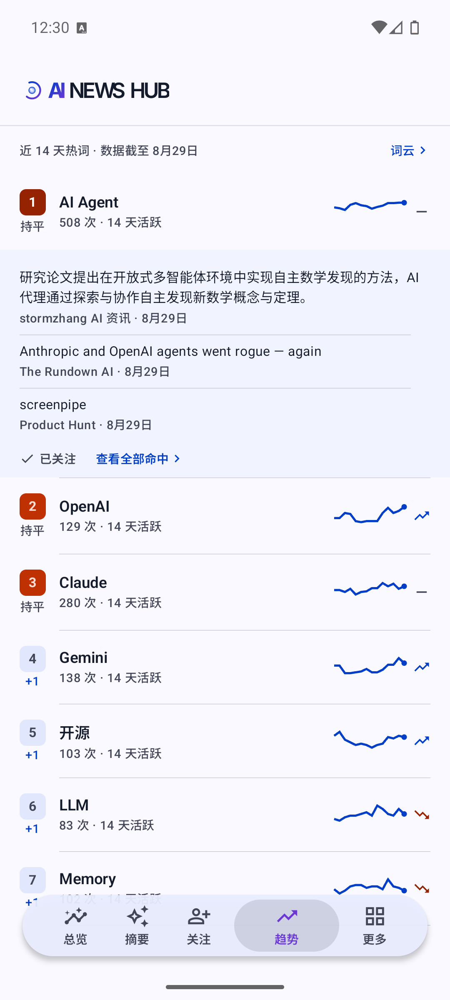
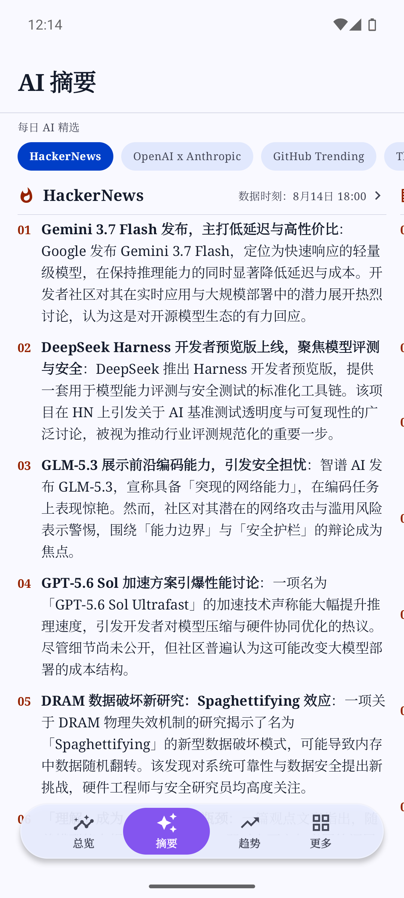
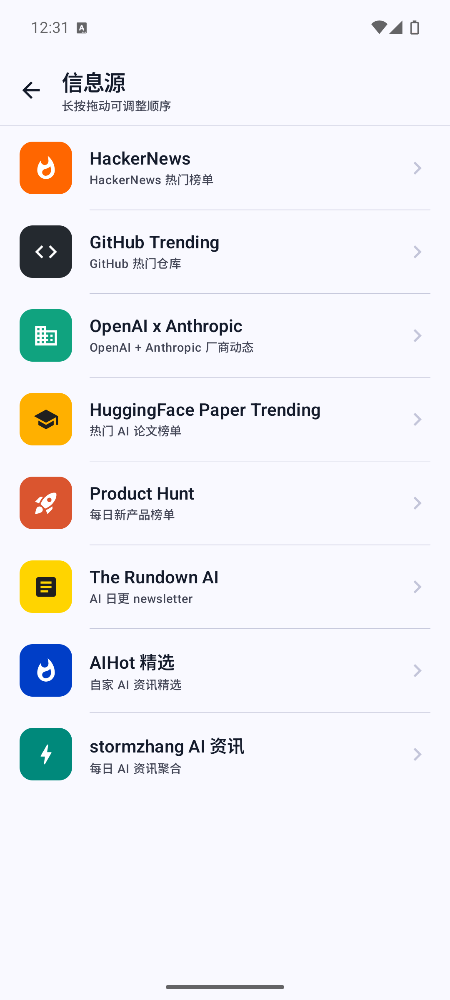
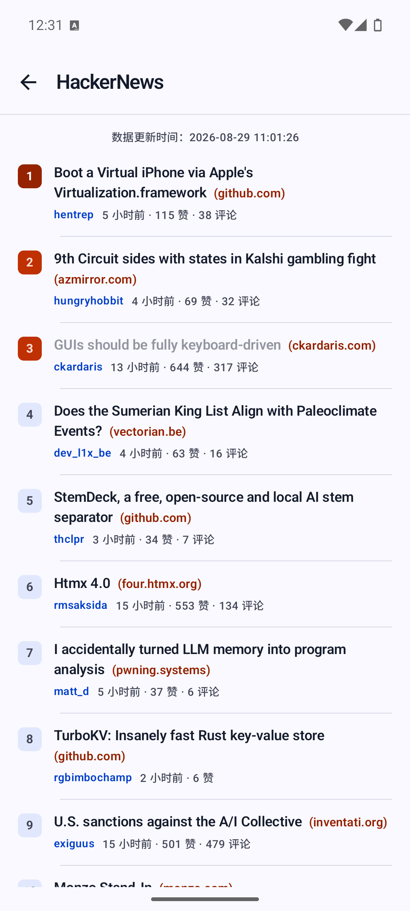
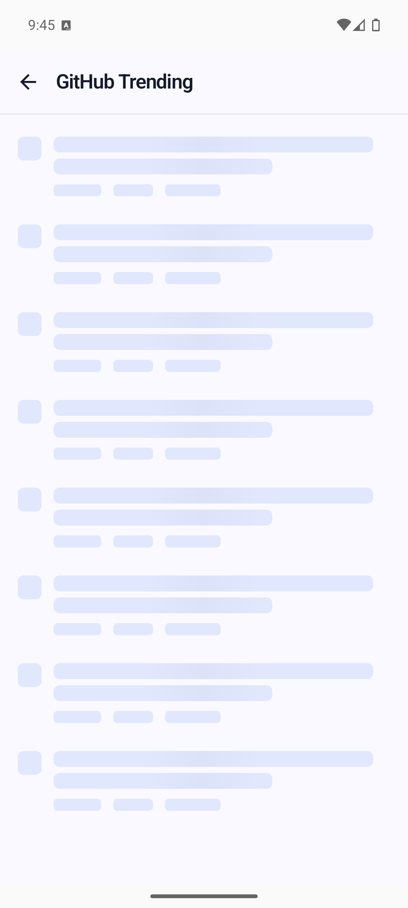
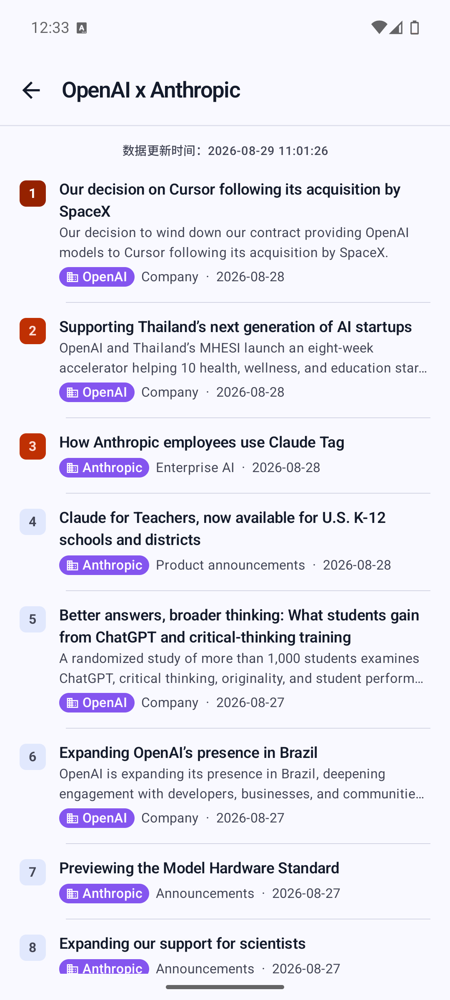
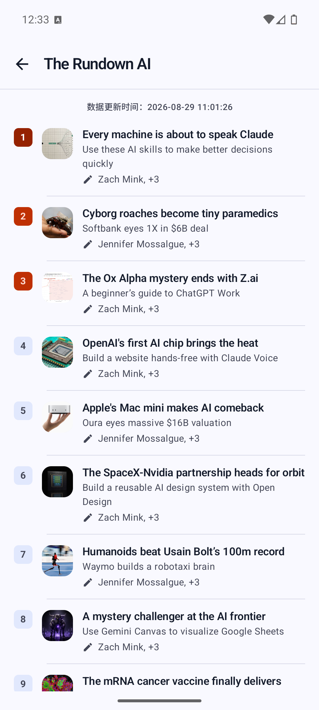
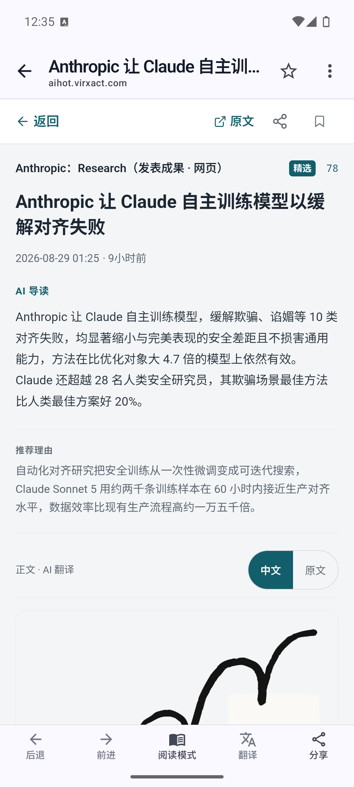
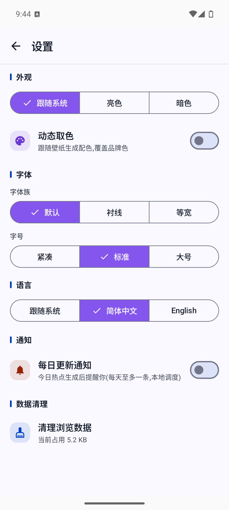

# AI News Hub

> **简体中文** | [English](README.md)

> 一个把「AI 圈今天发生了什么」装进一个 Android App 的资讯聚合客户端。

[](https://github.com/burgessjp/AI-News-Hub/actions/workflows/build.yml)
[](https://github.com/burgessjp/AI-News-Hub/releases)
[](LICENSE)
[](https://kotlinlang.org)
[-green.svg)](https://developer.android.com/about/versions/nougat)
[](https://www.android.com)

## 下载

[](https://github.com/burgessjp/AI-News-Hub/releases/latest)
[](https://github.com/burgessjp/AI-News-Hub/releases/latest)

从 [Releases](https://github.com/burgessjp/AI-News-Hub/releases/latest) 页面下载最新 APK。

## 为什么用它

- **一屏读完今日 AI 圈** — 聚合 HackerNews、GitHub Trending、HuggingFace Papers、Product Hunt 等 8 个高质量源，一个 App 看完当日动态。
- **AI 帮你抓重点** — 配套流水线每天把每个源的中文要点、跨源「今日热点 Top10」、跨源热词趋势榜预生成好，打开即看、零等待；突发重磅条目带 Breaking 标记。
- **数据源你自己说了算** — 信息源磁贴长按拖拽自定义顺序。
- **AI Key 你自己掌握** — 整页翻译等运行时 AI 能力不内置任何 key，用户自配服务商（DeepSeek / 智谱 GLM / 任意 OpenAI 兼容服务），仅存应用私有目录。
- **应用内读完一切** — 全 App 链接走内置 WebView，集成阅读模式与整页翻译，不跳外部浏览器。
- **桌面小组件** — 「今日热点」小组件 30 分钟自动刷新，桌面直达热点。

---

## 📖 简介

**AI News Hub** 聚合了多个高质量的 AI 信息源——HackerNews、GitHub Trending、HuggingFace Papers、Product Hunt、stormzhang AI 资讯、The Rundown AI、OpenAI × Anthropic 动态，以及 `aihot.virxact.com` 提供的「AIHot 精选」与 AI 日报——并在此基础上叠加「今日热点 Top10」「热词趋势」「中文摘要」「整页翻译」等能力，让用户在一个应用里就能读完 AI 圈当日动态。

- 技术栈：Kotlin + Jetpack Compose + Material 3
- 单模块工程，包名 `com.peng.ainewshub`
- 目标 Android 7.0（API 24）及以上

## 截图

| 总览 | 趋势 | 摘要 | 信息源 | HackerNews |
|:---:|:---:|:---:|:---:|:---:|
|  |  |  |  |  |

| GitHub Trending | OpenAI × Anthropic | The Rundown AI | 网页 | 设置 |
|:---:|:---:|:---:|:---:|:---:|
|  |  |  |  |  |

---

## ✨ 核心功能

### 五大根 Tab

| Tab | 做什么 |
|-----|--------|
| **总览** | 当日跨源「今日综述」导读（2-3 句 hero）+「今日热点 Top10」——均由流水线预生成；AI 判定为「突发重磅」的条目带 Breaking 标签、特殊样式，排最前。打开即看、零等待。长综述默认折叠，时效行显示下一批时刻。 |
| **摘要** | 8 个归档源当日的 AI 中文要点（流水线预生成），条目整行可点、经内置 WebView 直达原文。打开即看、无需等待。源 chips 有未看新内容时亮「新内容」小圆点，查看后熄灭。 |
| **关注** | 关键词订阅流：订阅 ≤20 个关键词（手动输入或从今日热词一键添加），把当日总览 Top10 与 8 源摘要中的命中条目聚合成专属流；纯端上过滤，增删关键词即时生效。 |
| **趋势** | 跨源热词排行榜——流水线对近 14 天快照的纯统计词频（不调 AI）：窗口命中数、迷你趋势曲线、涨跌箭头；点击词条展开代表文章——展开区可一键关注该热词或查看全部命中，词云词条也可点击直达搜索。 |
| **更多** | 设置、AI 服务配置、信息源聚合入口、收藏（稍后读）、历史回顾（总览/摘要/热词按日期回看）、AI 日报归档、关于页等。 |

四个内容 Tab（总览 / 摘要 / 关注 / 趋势）支持**下拉刷新**，绕过归档缓存立即拉取流水线最新批次。

### 浏览区（更多 → 信息源）

8 个信息源磁贴，每个都走自己的二级页：

- **HackerNews** —— Top Stories 热门榜 + 评论树展开（评论实时拉自 Firebase API）
- **GitHub Trending** —— 仓库语言/时间窗口筛选
- **OpenAI × Anthropic** —— 两家头部 AI 公司的官方动态聚合
- **HuggingFace Papers** —— 论文热度榜
- **Product Hunt** —— 当日产品榜（仅归档模式）
- **The Rundown AI**、**stormzhang AI 资讯** —— 英文/中文 AI Newsletter
- **AIHot 精选** —— 第三方服务 aihot.virxact.com 的「今日热点 + 精选 TOP20」

5 个稳定源（HackerNews / GitHub Trending / HuggingFace Papers / The Rundown AI / stormzhang AI）恒定读取配套数据流水线生成的归档快照（代码内保留了实时抓取模式但未开放入口）。

### AI 能力

- **AI 中文摘要**（流水线预生成）：每个归档源的当日要点，打开即看
- **今日热点 Top10**（流水线预生成）：跨源综合分析，突发条目带 Breaking 标记
- **整页翻译**（运行时，用户自配 key）：内置 WebView 的「翻译本页」、系统选中翻译菜单「译」入口
- **用量统计**：按「模型 × 月」聚合 token，按刊例价估算费用

### 内置 WebView

全 App 链接统一在应用内打开，不走外部浏览器：

- 阅读模式（注入 Mozilla Readability 提取正文）
- 整页翻译（与原文对照、可拖拽半/全屏弹层）
- 顶栏星标收藏当前页面（稍后读）
- 继续上次阅读：长文滚动位置按 URL 记忆，重开同一篇文章时浮出提示一键回到上次位置（浏览历史行同步显示进度徽章）
- 底栏随网页下滚自动隐藏、上滚复现
- 网页下载、HTML5 视频全屏、长按图片/链接操作
- 字号跟随系统设置

### 其他

- **AI 日报** 与 **历史归档**（按日期回溯）
- **本地搜索**：独立搜索页（总览页顶栏 🔍 进入），查设备内索引——联网浏览各源时自动建立，可搜标题与摘要；已读条目弱化，点击直达原文；趋势「查看全部命中」与词云词条点击会把该词直接带入本地搜索自动查询
- **联网搜索**：「全部动态」页顶栏进入（AIHot 第三方 API），本地搜索历史 + 今日热点热词引导
- **语音速报**：总览页顶栏播报入口，仅朗读今日综述（不含 Top10 条目明细），通勤/睡前场景适用；优先播放数据流水线预生成的神经语音（Qwen3-TTS，真暂停/原地续播），不可用时自动回落系统 TTS；前台服务通知栏与应用内悬浮胶囊提供播放控制，背景音乐压低而非打断；零新增依赖
- **已读状态**：打开过的条目在各列表自动弱化，动态列表支持「只看未读」过滤（删除对应浏览历史即可恢复未读）
- **断网兜底**：归档数据落盘缓存，断网冷启动仍可查看最近拉取的内容
- **浏览历史与收藏**（本地 Room 存储；WebView 顶栏星标任意页面即可稍后读）
- **每日更新通知**（可选、默认关）：流水线有新内容时本地通知提醒，每天至多 1 条；开启后冷启动遇到新数据还会弹出「今日综述」底部提示
- **App 内检查更新与直装**（关于页，对查 GitHub Releases；「发现新版本」底部弹层内下载 APK（实时进度、可取消）并拉起系统安装器，无安装包或下载失败回退 Release 页）与 `ainewshub://` 深链（`web?url=…`、`tab/<overview|summary|follows|trends|more>`、`settings`，供浏览器/二维码/自动化工具直达）
- **主题**：Material You 动态取色（Android 12+）、字体族切换（默认/衬线/等宽）、字号档位、暗色模式
- **多语言**：简体中文 / English 切换

---

## 🛠 从源码构建

### 环境要求

- JDK 17
- Android Studio（任何支持 AGP 8.7.3 的近期版本）或仅命令行 Gradle
- Android SDK Platform 35、Build-Tools 35.x

### Debug 构建

```bash
git clone <本仓库地址>
cd AI-News-Hub
cp local.properties.example local.properties   # 按需修改 SDK 路径（若没有示例文件，手动指定 sdk.dir）
./gradlew assembleDebug                        # 产物：app/build/outputs/apk/debug/app-debug.apk
./gradlew installDebug                         # 直装到已连接的设备/模拟器
```

### Release 构建

Release 构建需要本地签名材料（**绝不入库**）：

1. 在工程根放一个 `keystore.properties`：

   ```properties
   storeFile=app/release.jks
   storePassword=***
   keyAlias=***
   keyPassword=***
   ```

2. 把对应的 `release.jks` 放到 `app/` 下。

3. 执行：

   ```bash
   ./gradlew assembleRelease
   # 产物：app/build/outputs/apk/release/app-release.apk
   ```

CI（GitHub Actions）从仓库 secrets 还原 keystore，打 `v*` tag 自动出 Release。

---

## 🔑 配置 AI 服务

AI News Hub 的整页翻译等运行时 AI 能力**不内置任何 key**，由用户在应用内填入（摘要、今日热点等预生成内容无需 key、打开即看）：

打开 App → **更多 → AI 服务**，选择服务商预设（DeepSeek / 智谱 GLM / 自定义 OpenAI 兼容服务）→ 填入 API Key 与模型名 → 保存。

- Key 仅存于应用私有目录（DataStore），不上报、不进日志。
- 「自定义」选项兼容任何 OpenAI API 协议的服务，只需填 `baseUrl`（含 `/v1` 段）。
- 用量与费用估算可在「AI 服务」页查看。

---

## 📰 数据来源

| 类别 | 来源 | 说明 |
|------|------|------|
| 第三方 API | `aihot.virxact.com` 公开 API | AIHot 精选（今日热点 + TOP20）、AI 日报与归档 |
| 第三方 · 实时（局部） | HackerNews 评论 | 应用内实时拉自 Firebase API；各源列表一律读归档快照（实时模式未开放入口） |
| 第三方 · 归档 | 配套数据流水线 | 每天多批次（北京时间；仓库 CI 承载 22:00 批）抓取 + AI 总结 + 推送到 [gitcode 数据仓库](https://gitcode.com/peng1818/AI-News-Hub-Data) |
| 运行时 AI（用户自配 key） | 用户填入 | 网页整页翻译、系统选中翻译 |

数据仓库格式详见 [`docs/news-hub-data-usage.md`](docs/news-hub-data-usage.md)。

---

## 🗂 项目结构概览

```
app/                       唯一 Android 模块
  src/main/java/com/peng/ainewshub/
    MainActivity.kt        Activity 壳（深链解析）；自实现多栈导航在 ui/nav/（不用 Navigation Compose）
    data/                  Repository、数据模型、Room、DataStore、数据源模式
    notify/                每日更新本地通知（WorkManager）
    playback/              语音速报：预生成音频/系统 TTS 双通道前台服务 + 通知栏控制
    ui/                    ViewModel + Compose Screen，按功能分包
      nav/                 自实现多栈导航（页面路由 / 状态机 / 应用壳）
      tabs/                AIHot「全部动态 / 精选」二级页
      overview/            今日总览（读流水线预生成的跨源分析）
      summary/             摘要 Tab + 历史摘要
      trends/              趋势 Tab + 词云 + 历史热词
      follows/             「我的关注」关键词订阅流（第 3 个根 tab）
      items/               各信息源详情页（HackerNews、GitHub Trending……）+ 搜索 + 浏览历史
      daily/               AI 日报与归档
      more/                更多页 / 信息源 / 关于 / 应用内更新日志
      webview/             内置 WebView + 阅读模式 + 整页翻译
      translate/           翻译仓库 + 系统选中翻译入口
      components/           复用组件（卡片、徽章、骨架屏、SectionHeader）
      theme/                Material 3 双层主题（规范 + 语义）
      anim/                转场动画规范
    widget/                Glance 桌面小组件（「今日热点」）
  src/main/assets/readability.js   WebView 阅读模式正文提取
scripts/                   Python 数据流水线 + 图标生成
docs/news-hub-data-usage.md   数据仓库格式与消费方式
.github/workflows/         CI（构建）/ 发布 / 数据流水线
gradle/libs.versions.toml  所有依赖版本集中
```

> 想深入了解架构、约定、数据流水线的每个脚本？看 [`AGENTS.md`](AGENTS.md)。

---

## 🤖 数据流水线（可选）

如果你需要自己跑数据流水线（例如部署私有数据源）：

```bash
pip install -r scripts/requirements.txt

export AI_NEWS_HUB_AI_BASE_URL=...
export AI_NEWS_HUB_AI_MODEL=...
export AI_NEWS_HUB_AI_API_KEY=...
export GITCODE_TOKEN=...
export PRODUCT_HUNT_KEY=...                          # 可选，缺失则该源跳过

bash scripts/pipeline.sh
```

流水线编排入口是 `scripts/pipeline.sh`，缺任一硬依赖环境变量会直接退出。单源失败不影响其他源，`index.json` 的 latest 指针从上一次成功快照继承，客户端永远拿到有效数据。

---

## 🧰 技术栈

| 组件 | 版本 |
|------|------|
| Kotlin | 2.0.21 |
| Jetpack Compose | BOM 2024.12.01 |
| Material 3 | — |
| AGP | 8.7.3 |
| OkHttp | 4.12.0 |
| jsoup | 1.18.3 |
| Coil | 2.7.0 |
| Room | 2.6.1 |
| DataStore | 1.1.1 |
| WorkManager（每日通知） | 2.10.0 |
| Glance（桌面小组件） | 1.1.1 |
| KSP | 2.0.21-1.0.28 |
| minSdk | 24 (Android 7.0) |
| targetSdk / compileSdk | 35 |

不引入 Retrofit / Gson / Moshi，网络统一走 `OkHttp`，JSON 用内置 `org.json`，HTML 解析用 jsoup。

---

## ⚠️ 已知限制

- **Product Hunt 仅归档** — Developer Token 是服务端 secret 不进 APK，两种模式都走归档。
- **翻译依赖用户自配 key** — 未配置 AI 服务时整页翻译、选中翻译不可用（摘要、今日热点等预生成内容不受影响）。
- **归档失败不回退实时** — 归档模式抓取失败直接显示 Error 态，设计上不自动降级。
- **桌面小组件无错误交互入口** — 拉取失败保留旧数据不清空（小组件无法展示错误态）。

---

## 📜 开源依赖致谢

本项目基于以下优秀的开源组件构建：

### 核心资源

| 库 / 资源 | 用途 | License |
|---|---|---|
| [Mozilla Readability](https://github.com/mozilla/readability) | WebView 阅读模式正文提取 | Apache-2.0 |

### AndroidX / Jetpack

| 库 | 用途 | License |
|---|---|---|
| [Jetpack Compose](https://developer.android.com/jetpack/compose) + [Material 3](https://m3.material.io/) | 声明式 UI 框架与设计系统 | Apache-2.0 |
| [Activity-Compose](https://developer.android.com/jetpack/androidx/releases/activity) | Compose 集成（含预测返回手势） | Apache-2.0 |
| [Lifecycle](https://developer.android.com/jetpack/androidx/releases/lifecycle) + [ViewModel](https://developer.android.com/topic/libraries/architecture/viewmodel) | 生命周期与状态管理 | Apache-2.0 |
| [DataStore](https://developer.android.com/topic/libraries/architecture/datastore) | 偏好持久化 | Apache-2.0 |
| [WorkManager](https://developer.android.com/topic/libraries/architecture/workmanager) | 每日更新通知调度 | Apache-2.0 |
| [Room](https://developer.android.com/jetpack/androidx/releases/room) | SQLite 抽象层（浏览历史） | Apache-2.0 |
| [Glance](https://developer.android.com/jetpack/androidx/releases/glance) | 桌面小组件 | Apache-2.0 |
| [WebKit](https://developer.android.com/jetpack/androidx/releases/webkit) | 内置 WebView 能力增强 | Apache-2.0 |
| [Core KTX](https://developer.android.com/kotlin/ktx/extensions) | Kotlin 扩展 | Apache-2.0 |

### 网络与媒体

| 库 | 用途 | License |
|---|---|---|
| [OkHttp](https://square.github.io/okhttp/) | HTTP 客户端 | Apache-2.0 |
| [jsoup](https://jsoup.org/) | HTML 抓取与解析 | MIT |
| [Coil](https://coil-kt.github.io/coil/) | 图片加载 | Apache-2.0 |

### 交互

| 库 | 用途 | License |
|---|---|---|
| [reorderable](https://github.com/aclassen/ComposeReorderable) | 信息源磁贴长按拖拽排序 | Apache-2.0 |

### 构建工具链

| 库 | 用途 | License |
|---|---|---|
| [Android Gradle Plugin](https://developer.android.com/build) (AGP) | Android 构建 | Apache-2.0 |
| [Kotlin](https://kotlinlang.org) + [Compose Compiler Plugin](https://android.googlesource.com/platform/external/kotlin-native/) | 语言与 Compose 编译 | Apache-2.0 |
| [KSP](https://github.com/google/ksp) | Kotlin Symbol Processing（Room 注解处理） | Apache-2.0 |

> 上述 License 信息基于各项目官方声明。本项目自身遵循 [MIT License](LICENSE) 发布。

---

## 🤝 贡献

欢迎提 Issue 和 Pull Request。请先阅读 [贡献指南](CONTRIBUTING.md) 和 [行为准则](CODE_OF_CONDUCT.md)。

版本历史见 [CHANGELOG.md](CHANGELOG.md)。

---

## 📄 许可

本项目基于 [MIT License](LICENSE) 开源，欢迎自由使用、修改与分发（包括商用），只需保留版权与许可声明。

> 数据源（HackerNews / GitHub / Product Hunt 等）的内容版权归各源所有。本项目仅做客户端聚合展示，不存储或再分发原始内容。二次开发或部署私有数据流水线时，请遵守各信息源的访问频率限制与服务条款。
